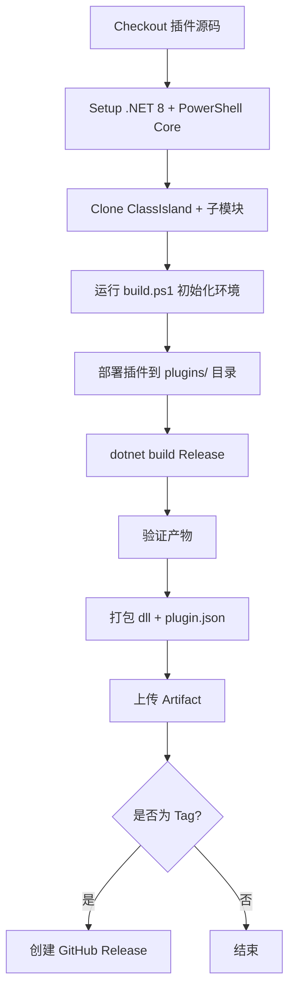

# GitHub Actions 自动构建配置

## 📁 文件结构

```
.github/
└── workflows/
    └── build-plugin.yml    # 主构建工作流
```

## 🚀 触发条件

| 触发方式 | 条件 |
|----------|------|
| **Push** | 推送到 `main`/`master` 分支且修改了 `LxMusicPlugin/**` |
| **PR** | 向 `main`/`master` 提交 PR 且涉及插件源码 |
| **手动** | Actions 页面点击 "Run workflow" |
| **Tag** | 推送 `v*` 标签 (如 `v1.0.0`) 自动创建 Release |

## ⚙️ 构建流程



## 📦 产物下载

构建完成后在 **Actions → 构建记录 → Artifacts** 下载：
- `LxMusicPlugin-windows.zip` - Windows 版插件包

## 🏷️ 发布版本

```bash
# 本地打标签推送，自动触发 Release
git tag v1.0.0
git push origin v1.0.0
```

GitHub 会自动：
1. 构建插件
2. 创建 Release `v1.0.0`
3. 附上 `LxMusicPlugin.dll`、`plugin.json` 等文件
4. 生成更新日志

## 🔧 自定义配置

编辑 `.github/workflows/build-plugin.yml`：

```yaml
env:
  CLASSISLAND_REPO: 'https://github.com/ClassIsland/ClassIsland.git'  # 可改为 fork 仓库
  PLUGIN_NAME: 'LxMusicPlugin'  # 插件文件夹名
```

### 启用 Linux 交叉编译

将 `build-linux` job 的 `if: false` 改为 `if: true`

## ⚠️ 注意事项

1. **首次运行较慢** - 需要克隆 ClassIsland + 下载子模块 + 还原 NuGet (~5-10 分钟)
2. **缓存优化** - 可添加 `actions/cache` 缓存 `~/.nuget/packages` 和 ClassIsland 源码
3. **密钥管理** - Release 需要 `GITHUB_TOKEN` (Actions 自带，无需配置)
4. **构建环境** - 必须在 `windows-latest` 运行，因为 ClassIsland 插件依赖 Windows 特有 API

## 🐛 常见问题

| 问题 | 解决 |
|------|------|
| `build.ps1` 失败 | 检查 PowerShell Core 版本，确保子模块已初始化 |
| 找不到 `ClassIsland.Core` | 确保 `git submodule update --init --recursive` 成功 |
| 产物为空 | 检查 `dotnet build` 输出路径，确认 `-c Release` |
| Release 未创建 | 确认 tag 格式为 `v*` (如 `v1.0.0`)，且推送了 tag |

## 📝 本地测试

```powershell
# 使用 act 本地测试 (需安装 act)
act push -W .github/workflows/build-plugin.yml --secret-file .secrets
```